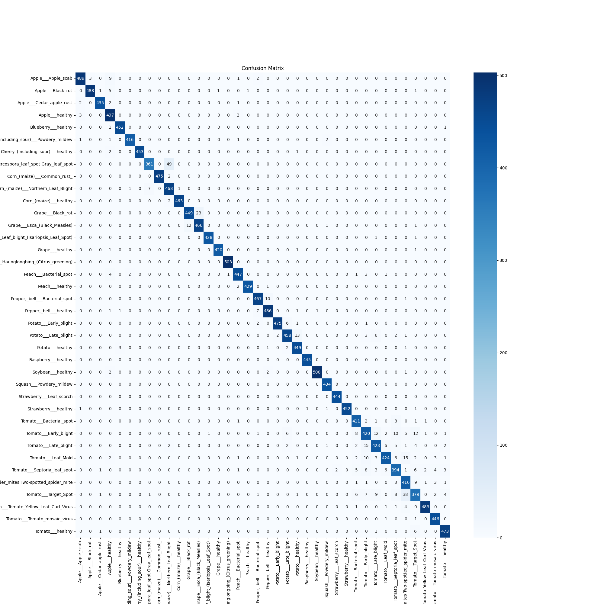

# 🌱 Plant Disease Classification using VGG16

This project uses **Transfer Learning with the VGG16 model** to classify plant leaf images into 38 different plant disease categories. It is trained using a labeled and augmented dataset from Kaggle and implemented in **TensorFlow and Keras** on **Google Colab**.

---

## 📂 Dataset

- **Source**: [New Plant Diseases Dataset](https://www.kaggle.com/datasets/vipoooool/new-plant-diseases-dataset)
- **Classes**: 38 plant diseases
- **Data Type**: Augmented images in `train/` and `valid/` folders
- **Input Size**: Resized to `224 x 224` for VGG16 compatibility

---

## 🧠 Model: VGG16 + Custom Classifier

The model uses VGG16 as the feature extractor (without the top layer), and a custom classification head is added to it.

### 🔧 Architecture:
- VGG16 base (frozen during training)
- `GlobalAveragePooling2D`
- `Dense(256, activation='relu')`
- `Dropout(0.5)`
- `Dense(38, activation='softmax')` (for 38 classes)

---

## 📊 Training

- **Platform**: Google Colab
- **Optimizer**: Adam
- **Loss Function**: Categorical Crossentropy
- **Epochs**: 10 (can be increased)
- **Metrics**: Accuracy

The model was evaluated on the validation set and showed high accuracy and good generalization.

---

## 📈 Results

- Training & validation accuracy plotted using `matplotlib`
- Classification report & confusion matrix visualized using `seaborn`

### Example Confusion Matrix:


### Sample Prediction:


---

## 🧪 How to Use

1. Clone the repository:
```bash
git clone https://github.com/your-username/plant-disease-classification-vgg16.git
cd plant-disease-classification-vgg16
pip install -r requirements.txt
from tensorflow.keras.models import load_model
model = load_model("trained_model.h5")
from tensorflow.keras.preprocessing import image
import numpy as np

# Load and process the image
img = image.load_img('path_to_leaf.jpg', target_size=(224, 224))
input_arr = image.img_to_array(img)
input_arr = np.expand_dims(input_arr, axis=0)  # Convert single image to a batch

# Predict the class
class_names = ['Class 1', 'Class 2', 'Class 3', ..., 'Class 38']  # Replace with actual class names
pred = model.predict(input_arr)

# Get the predicted class
predicted_class = class_names[np.argmax(pred)]

print(f"Predicted class: {predicted_class}")
